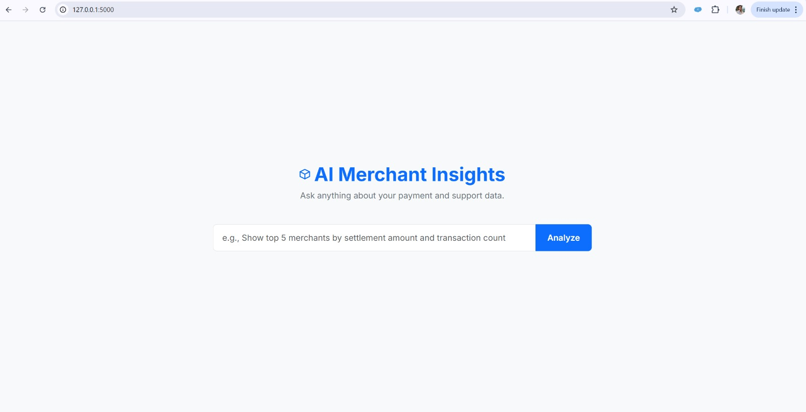

# Payment Analytics AI Assistant

**Analyze your payment transaction data effortlessly using natural language.**

The Payment Analytics AI Assistant is an intelligent system that empowers users to query and visualize complex payment data without writing any code. Simply ask your questions in plain English, and let the AI do the heavy lifting!

## ✨ Features

* **Natural Language Querying:** Interact with your data using everyday language.
* **Intelligent SQL Generation:** AI translates your requests into precise SQL queries.
* **Dynamic Data Visualization:** Automatically generates relevant charts (bar, line, pie, etc.) for deeper insights.
* **Real-time Insights:** Get immediate answers and visual analytics from your transaction records.
* **Agentic Flow:** Designed as an AI agent that interprets, plans, acts (queries database), and presents results autonomously.

## 🚀 How It Works

1.  **Ask a Question:** Users provide a natural language query (e.g., "What's the total settlement amount for IRCTC E-ticketing this month?").
2.  **AI Processes:** The AI, with a deep understanding of the `consolidated_payments` schema, interprets the intent.
3.  **SQL & Data:** An SQL query is generated and executed against the database to fetch the required data.
4.  **Visualize & Present:** Insights are extracted, and appropriate graphs are generated and displayed.

*Example: User input interface*

## 📊 Data Model

The system operates on a detailed `consolidated_payments` table, capturing comprehensive transaction attributes, statuses, payment modes, and financial metrics.

## 📈 Examples of Insights

* Total settlement amounts by merchant or payment mode.
* Daily/weekly/monthly trends in transaction volume or value.
* Breakdown of transaction statuses (CAPTURED, REFUNDED, FAILED).
* Analysis of various charges (MDR, bank fees, convenience fees).

*Example: A dynamically generated data visualization*